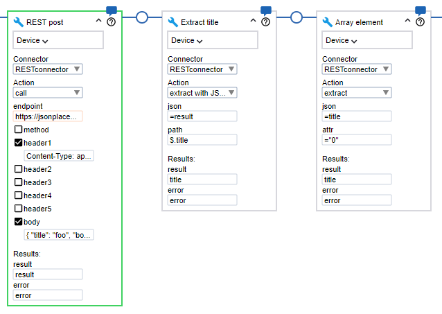

# REST Connector

In [Kofax RPA version 11.5](https://docshield.kofax.com/Portal/Products/en_US/RPA/11.5.0-nlfihq5gwr/RPA.htm)
we can run Robots stand-alone and seldomly have to fall back on functionality provided by Basic Engine robots.

Calling REST services however is not yet an option that is natively supported in the Robot workflow (it is in the Basic Engine Robot workflow),
and working with JSON strings is also limited, which is inconvenient when interacting with REST services.

However, Kofax RPA provides ways to add custom steps to the robot using external connectors written in any language,
and this Python REST connector aims to bridge the gap in functionality for now.

It provides a single custom step with several possible actions:

- performing a REST call (with support for headers and several HTTP methods)
- two helper actions to extract values from a JSON serialized object
  - extract (retrieves the value from an object attribute or array element)
  - extract with JSONPath (retrieves zero or more values from an JSON string)

Note: quite extensive comments are provided in the python sources, but be aware that this connector was not exhaustively tested, so use it with great care.

## Prerequisites

On all machines where this connector will be used, python (version 3.11 or newer) should be present,
and the `requests` and `jsonpath-ng` packages should be installed.
Be aware that the machine where the robot is running depends on the situation:

- in the Design Studio this will be on the same machine as the Design Studio itself,
- when running on a RoboServer that will be on any RoboServer in the cluster the Robot might run,
- when using the connector an a non-local device, this will be on that device, i.e. the remote machine.

Ensuring the packages are present could be done on the target machine with:

```
python -m pip install --upgrade requests jsonpath-ng
```

See [pypi:requests](https://pypi.org/project/requests/) and [Pypi:jsonpath-ng](https://pypi.org/project/jsonpath-ng/) for more info on those packages.

## Building

The connector should placed in an RPA project as a .zip file with a .connector extension.

If you change anything in the python files, makes sure to update the manifest.json accordingly and then:

- zip the python files along with the manifest and license
    (make sure they end up at the toplevel, i.e. not inside an additional folder)

- rename the .zip to .connector

in a bash shell this can be done in one go:

```bash
zip restconnector.connector *.py LICENSE manifest.json
```


## Installation

Simply copy the file `restconnector.connector` to the Library folder of the project you want to use it in.

## Usage

The connector currently provided three actions:

- `call`, that will call a REST service and return the result of the call, and
- `extract`, a helper action that takes a JSON serialized object and an attribute name and returns the value of that attribute
- `extract with JSONPath`, a helper action that takes a JSON serialized object and an JSONpath and returns zero or more values that match the path, serialized as a JSON array 

Examples of the steps are shown in this image:



### call

Has the following parameters:

- `endpoint`  the URL of the REST service
- `method`    optional, the method to use in the call, defaults to POST
- `header1`   optional, header to pass along with the call
- `header2`   idem
- `header3`   idem
- `header4`   idem
- `header5`   idem
- `body`      optional, the body to pass (typically a JSON serialized object)

It returns the body of the response on success or a JSON string containing an error attribute if something went wrong.

### extract

Has the following parameters

- `json`      a JSON serialized object, either an object or an array 
- `attr`      the name of an attribute, or a index

Note: if the JSON represents an array the `attr` parameter should be a *string* that represents the index!

### extract with JSONPath

- `json`      a JSON serialized object, either an object or an array 
- `path`      a [JSONPath](https://goessner.net/articles/JsonPath/) expression

Note: this action returns a array of zero or more matching elements, serialized as a JSON string.

## Examples

The folder `Example project` is a project that contains the connector and an example robot that makes use of it.

The robot posts a JSON body to the `/post` endpoint on [this freely usable REST backend](https://jsonplaceholder.typicode.com) and processes the result using the `extract with JSONPath` and `extract` actions. (See the comments inside the Test-REST.robot for some extra details)
